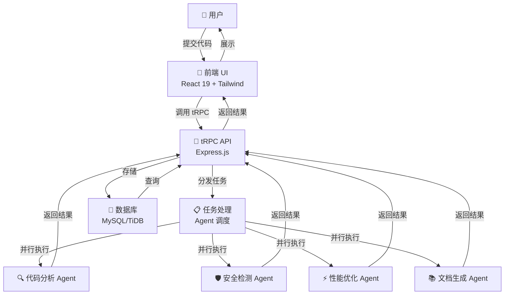
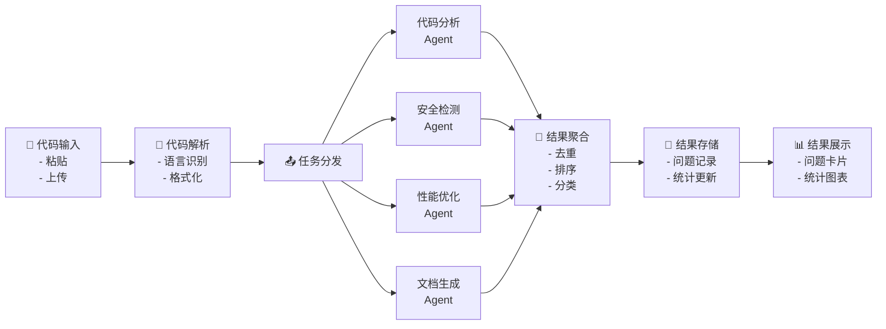
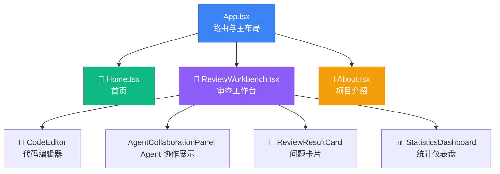
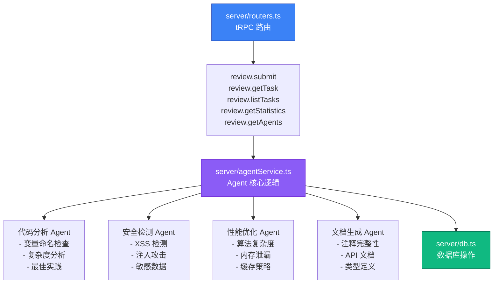
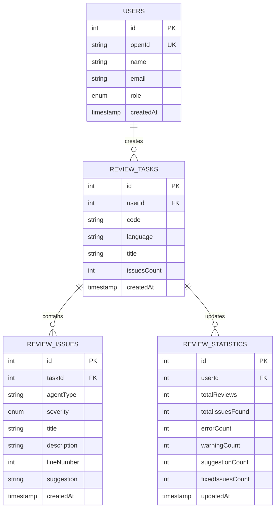
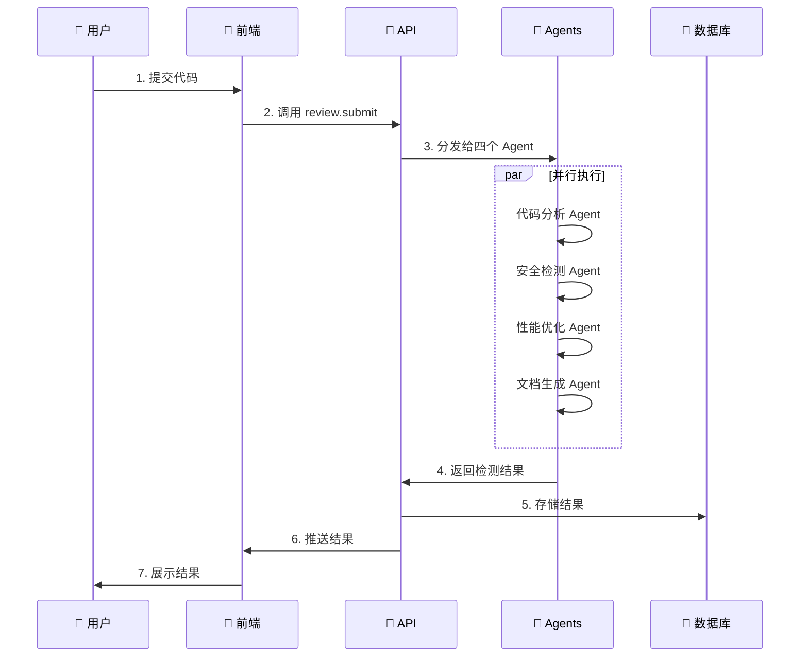

# 系统架构图

## 整体架构



## 数据流架构



## 前端架构



## 后端架构



## 数据库 Schema



## 执行流程时序图



## 技术栈层次

```
┌─────────────────────────────────────────────────────┐
│              前端展示层 (React 19)                   │
│  - 代码编辑器 | Agent 面板 | 结果卡片 | 统计图表    │
└────────────────────┬────────────────────────────────┘
                     │ tRPC
┌────────────────────▼────────────────────────────────┐
│           API 层 (Express.js + tRPC)                │
│  - 路由定义 | 请求处理 | 业务逻辑编排              │
└────────────────────┬────────────────────────────────┘
                     │
┌────────────────────▼────────────────────────────────┐
│         Agent 服务层 (agentService.ts)             │
│  - 代码分析 | 安全检测 | 性能优化 | 文档生成       │
└────────────────────┬────────────────────────────────┘
                     │
┌────────────────────▼────────────────────────────────┐
│         数据持久化层 (Drizzle ORM)                  │
│  - 任务存储 | 问题记录 | 统计数据                   │
└────────────────────┬────────────────────────────────┘
                     │
┌────────────────────▼────────────────────────────────┐
│         数据库层 (MySQL/TiDB)                       │
│  - 关系型数据存储 | 事务管理 | 索引优化            │
└─────────────────────────────────────────────────────┘
```

## 当前实现状态

### ✅ 已实现的组件
- React 19 前端应用
- Express.js + tRPC 后端 API
- Drizzle ORM 数据库层
- MySQL/TiDB 数据库
- 四个 Agent 服务（模拟实现）
- 完整的用户界面与交互流程

### 🔄 规划中的功能
- 真实 LLM 集成（GPT-4/Claude）
- 历史记录对比功能
- 导出审查报告（PDF/Excel）
- IDE 插件（VS Code/JetBrains）
- 团队协作功能
- 缓存层优化
- 负载均衡与多实例部署
